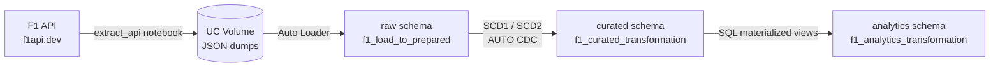
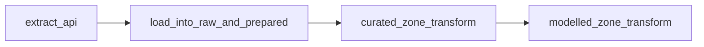
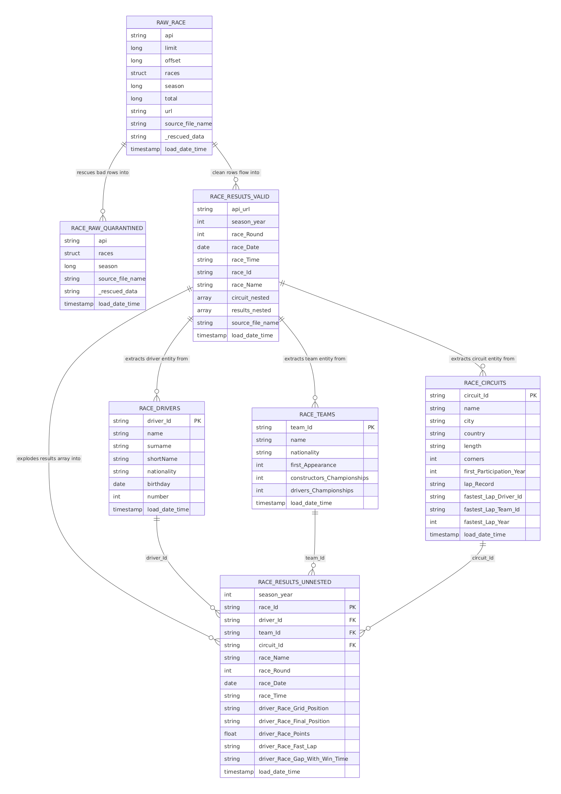
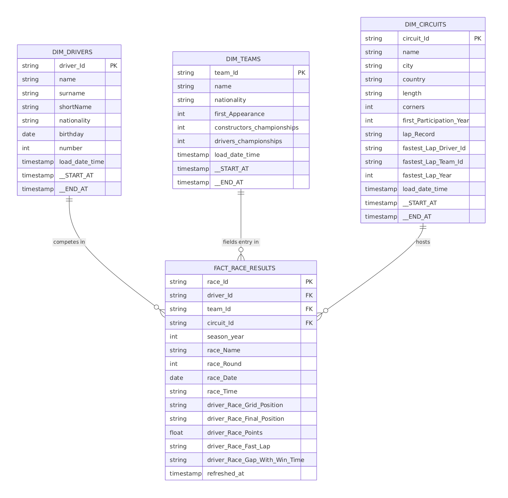
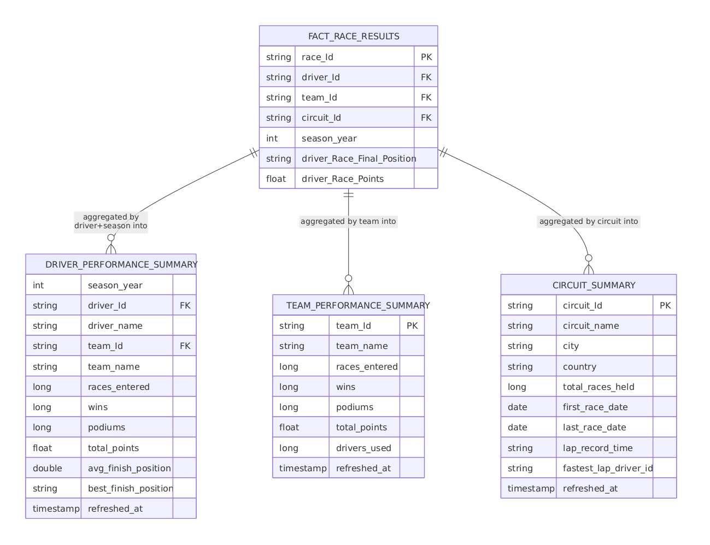

# F1 Databricks Lakehouse

An end-to-end Formula 1 race data pipeline built on Databricks, using **Spark Declarative Pipelines** (Lakeflow) and the **Medallion Architecture**. Race results are pulled from a public F1 API, then flow through raw → curated → analytics zones, ending in queryable driver, team, and circuit performance summaries.

Deployed entirely as a [Databricks Asset Bundle](https://docs.databricks.com/aws/en/dev-tools/bundles/) — one `databricks bundle deploy` stands up the catalog objects, three Lakeflow pipelines, and the orchestrating job.

## Architecture



Each zone is deployed as its own Lakeflow pipeline. A single Databricks Job (`f1_ingest_and_transform_workflow`) chains all four steps in sequence:



| Zone | Pipeline | Key tables |
|---|---|---|
| Raw | `f1_load_to_prepared` | `raw_race`, `race_raw_quarantined`, `race_results_valid`, `race_results_unnested`, `race_drivers`, `race_teams`, `race_circuits` |
| Curated | `f1_curated_transformation` | `dim_drivers` (SCD2), `dim_teams` (SCD2), `dim_circuits` (SCD2), `fact_race_results` (SCD1) |
| Analytics | `f1_analytics_transformation` | `driver_performance_summary`, `team_performance_summary`, `circuit_summary` |

## Data model

Each medallion zone has its own ER diagram below, reflecting the tables that pipeline actually produces.

### Raw layer

`f1_load_to_prepared` — Auto Loader ingestion, quarantine, and flattening of the source JSON.



### Curated layer

`f1_curated_transformation` — the conformed star schema. Dimensions are maintained as **SCD Type 2** (full history, via `dp.create_auto_cdc_flow`), the fact table as **SCD Type 1** (latest state only).



### Modelled (analytics) layer

`f1_analytics_transformation` — gold materialized views built off the curated fact and dimension tables.



## Repository structure

```
.
├── AGENTS.md
├── CLAUDE.md
├── README.md
├── databricks.yml                             # Bundle definition, dev/prod targets & variables
├── fixtures/
├── resources/
│   ├── databricks_entity_creation/
│   │   └── base_objects_creation.yml          # Catalog schemas + UC volume
│   ├── job_definitions/
│   │   └── f1_ingest_and_transform_workflow.yml   # The orchestrating job
│   └── transformation_pipelines/
│       ├── f1_load_to_prepared.yml            # Raw pipeline definition
│       ├── f1_curated_transformation.yml      # Curated pipeline definition
│       └── f1_analytics_transformation.yml    # Analytics pipeline definition
└── src/
    ├── ingestion/
    │   └── extract_f1_source_data.ipynb       # Pulls race data from f1api.dev
    ├── transformations/
    │   ├── prepared/
    │   │   └── race_data_load_raw_and_prepared.py   # Bronze: Auto Loader ingestion + flattening
    │   ├── curated/
    │   │   └── race_data_curated.py           # Silver: SCD1/SCD2 dimensional model
    │   └── modelled/
    │       ├── driver_performance_summary.sql # Gold: driver aggregates
    │       ├── team_performance_summary.sql   # Gold: team aggregates
    │       └── circuit_summary.sql            # Gold: circuit aggregates
    └── utility/
        └── utiltiy_notebook.ipynb             # One-off catalog setup notebook
```

## Prerequisites

- A Databricks workspace with Unity Catalog enabled
- [Databricks CLI](https://docs.databricks.com/dev-tools/cli/install.html) v0.240+
- Permissions to create catalogs, schemas, and volumes

## Setup

### 1. Create a personal access token

1. In your Databricks workspace, go to **Profile → Settings**, then under the **User** section open the **Developer** subsection. Click **Manage** next to **Access tokens**.
2. Click **Generate new token**, enter a **Lifetime (days)**, and set **Scope** to **Other APIs**.
3. For **API scope(s)**, choose **All APIs**.
4. Copy the generated token — you won't be able to view it again.

### 2. Clone and authenticate

```bash
git clone https://github.com/vikneshwara-r-b/f1-databricks-lakehouse.git
cd f1-databricks-lakehouse
databricks auth login --host https://<your-workspace-url>
```

When prompted, paste in the personal access token generated above.

### 3. Review variables

Check `databricks.yml` for the `dev` target — by default it deploys into the `workspace` catalog with `raw` / `curated` / `analytics` schemas. Adjust `catalog`, schema names, or the workspace `host` as needed.

### 4. Validate and deploy

```bash
databricks bundle validate -t dev
databricks bundle deploy -t dev
```

This creates the schemas and volume, the three Lakeflow pipelines, and the orchestrating job (prefixed `[dev <you>]` in development mode).

### 5. Run the pipeline

```bash
databricks bundle run f1_ingest_and_transform_workflow -t dev
```

Optionally override job parameters to pull a different race:

```bash
databricks bundle run f1_ingest_and_transform_workflow -t dev \
  --params f1_season_year=2023,f1_season_round=5
```

### 6. Query the results

```sql
SELECT driver_name, team_name, wins, podiums, total_points
FROM workspace.analytics.driver_performance_summary
ORDER BY total_points DESC;
```

## Deploying to production

```bash
databricks bundle deploy -t prod
```

The `prod` target deploys to a dedicated `f1_analytics` catalog and a fixed workspace path, with job schedules unpaused.

## Tech stack

- **Databricks Lakeflow (Spark Declarative Pipelines)** — `pyspark.pipelines` (`dp`) for the raw and curated layers, SQL materialized views for the analytics layer
- **Auto Loader** (`cloudFiles`) for incremental JSON ingestion, with schema rescue for malformed records
- **`dp.create_auto_cdc_flow`** for SCD Type 1 / Type 2 dimensional modeling
- **Databricks Asset Bundles** for all deployment and orchestration — no manual cluster or job setup
- **Unity Catalog** for schema, volume, and table governance

## Data source

Race data is sourced from the [f1api.dev](https://f1api.dev) public API.